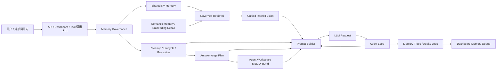
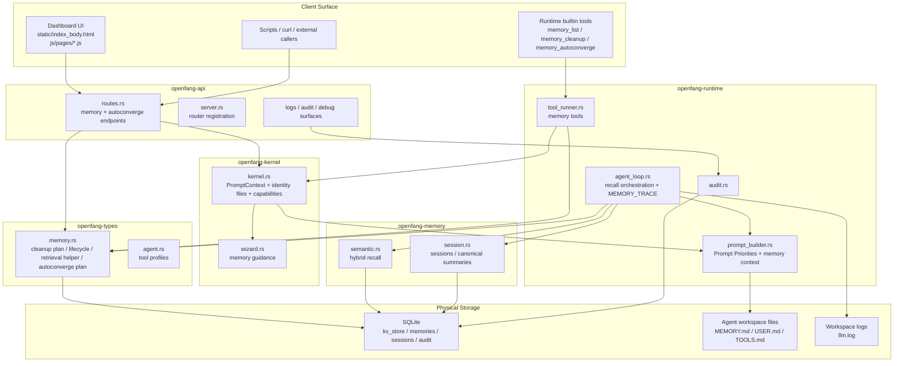

# 技术方案：Agent 长期记忆增强与 Prompt 编排落地说明

## 1. 文档定位

本文档描述的是当前分支里已经落地完成的整套记忆系统，而不再只是早期的 memory enhancement MVP。

它回答四个问题：

1. 这套记忆能力最终给 OpenFang 带来了什么。
2. 整体技术架构是怎么分层的。
3. 关键技术点分别采用了什么方案。
4. 现在代码里的主要入口和职责边界在哪里。

本文档覆盖的能力范围包括：

- shared KV memory governance
- governed retrieval 与 hybrid recall
- prompt architecture 与 memory context arbitration
- memory trace / dashboard inspection
- `MEMORY.md` autoconverge review / apply 闭环

治理细节的补充说明仍保留在：

- `docs/memory/memory_governance_plan.md`

## 2. 这套记忆系统最终解决了什么问题

OpenFang 原本已经有多种和“记忆”相关的组件：

1. shared KV：`memory_store` / `memory_recall`
2. agent workspace 里的 `MEMORY.md`
3. `memory/*.md` 一类工作区文件
4. `session_*` 摘要和会话历史
5. semantic memory / embedding substrate

但这些组件在改造前没有形成稳定闭环，主要问题是：

1. 记忆能存，但缺少治理，shared KV 很容易变脏。
2. 记忆能 recall，但排序弱、只靠精确 key 或单一路径。
3. prompt 里没有稳定的优先级与预算控制，记忆容易被淹没或互相冲突。
4. `MEMORY.md` 是静态文件，无法和 shared governed memory 形成 write-back 闭环。
5. 出现召回异常时，缺少可观察性，很难判断问题出在 recall、prompt 还是 tool exposure。

这次落地完成后，系统已经具备：

1. 可治理的 shared memory 池。
2. 可混合召回的统一记忆上下文。
3. 可仲裁的 prompt 记忆编排。
4. 可检查、可调试、可追踪的 memory trace。
5. 可 audit / apply 的 `MEMORY.md` managed snapshot。
6. agent 自己可调用的记忆维护工具链。

一句话总结：记忆现在已经从“分散存在的组件”变成了一条完整工作链路。

## 3. 已交付能力总览

### 3.1 存储与治理

shared KV 现在不再只是松散的 key/value 存储，而是具备了：

- canonical namespacing
- metadata sidecar
- `kind` / `tags` / `freshness` / `source` / `updated_at`
- lifecycle snapshot：`active` / `stale` / `expired`
- promotion candidate 标记
- cleanup audit / apply

### 3.2 检索与召回

记忆召回现在覆盖两条来源：

- semantic memory fragments
- governed shared memory candidates

并且已经升级为：

- hybrid recall：vector rank + text rank + RRF
- query-aware governed candidate ranking
- shared + semantic prompt-time fusion

### 3.3 Prompt 编排

prompt 现在不再只是把“能拿到的记忆”直接塞进去，而是具备了：

- `Prompt Priorities`
- workspace guidance authority ordering
- dynamic memory context section budget
- cross-section deduplication
- governance attention / maintenance signals

### 3.4 写回闭环

`MEMORY.md` 现在不再只是人工维护的静态文件，而是新增了：

- autoconverge audit plan
- managed block render / replace
- API review / apply
- runtime tool `memory_autoconverge`
- dashboard preview / apply

### 3.5 可观测性与 inspection

这套链路现在有完整 inspection 面：

- `llm.log` 中的 `*** MEMORY TRACE`
- structured telemetry
- audit events
- dashboard Logs / Memory Trace
- standalone `Memory Debug` page

## 4. 逻辑架构图

这张图表达的是逻辑职责关系：

1. shared KV 先经过 governance，得到 lifecycle、cleanup、promotion 等治理语义。
2. retrieval 同时消费 semantic memory 和 governed shared memory。
3. prompt builder 汇总 unified recall、governance signals、`MEMORY.md` managed snapshot。
4. autoconverge 把 durable long-term facts 写回 agent workspace 的 `MEMORY.md`。
5. 整个运行链路会把 trace 暴露到日志、audit 和 dashboard inspection。

## 5. 物理架构图

这张图表达的是代码和存储落点：

1. 规则中心在 `openfang-types::memory`，这里沉淀治理、召回、autoconverge 的共享语义。
2. 真正执行编排的是 `openfang-runtime`，包括 agent loop、prompt builder、tool runner。
3. `openfang-kernel` 负责 identity files、capability 和 prompt context 装配。
4. `openfang-api` 负责 HTTP 路由和 dashboard surface。
5. 底层物理载体主要是 SQLite、agent workspace 文件和 `llm.log`。

## 6. 总体架构分层

整套实现可以概括成 6 层。

### 6.1 Shared Memory Governance 层

职责：

- 规范 shared KV 的键空间
- 给用户侧 memory 叠加治理元数据
- 提供 lifecycle / promotion / cleanup 规则

核心位置：

- `crates/openfang-types/src/memory.rs`
- `crates/openfang-api/src/routes.rs`
- `crates/openfang-runtime/src/tool_runner.rs`

这一层的关键原则是：

1. 不重做底层 SQLite schema。
2. 用 internal sidecar metadata 承载治理信息。
3. 让 tool / API / prompt / dashboard 复用同一套 helper，而不是各写一份语义。

### 6.2 Retrieval 层

职责：

- 从 semantic memory 和 governed shared memory 中挑出当前 turn 真正有价值的上下文

核心位置：

- `crates/openfang-memory/src/semantic.rs`
- `crates/openfang-runtime/src/agent_loop.rs`
- `crates/openfang-types/src/memory.rs`

这一层的关键原则是：

1. semantic recall 不只依赖 embedding，embedding 缺失时也不能丢失 text hit。
2. shared governed memory 必须进入真实召回链路，而不是只停留在 API 可见。
3. 最终进入 prompt 的 recall 结果应该是统一排序的，而不是多段互相竞争的上下文。

### 6.3 Prompt Architecture 层

职责：

- 决定哪些记忆应该进入 prompt
- 决定它们以什么优先级、什么预算、什么形式进入 prompt

核心位置：

- `crates/openfang-runtime/src/prompt_builder.rs`
- `crates/openfang-runtime/src/agent_loop.rs`
- `crates/openfang-kernel/src/kernel.rs`

这一层的关键原则是：

1. 静态长期信息走 system prompt。
2. 动态 turn-specific 记忆走独立 message。
3. 通过 priorities、budget、dedup 控制 prompt 噪音。

### 6.4 Workspace Identity / `MEMORY.md` 层

职责：

- 把 agent 长期约束和稳定上下文落在 workspace identity files 上
- 让 `MEMORY.md` 成为长期记忆的稳定承载点

核心位置：

- `crates/openfang-kernel/src/kernel.rs`
- `crates/openfang-runtime/src/prompt_builder.rs`
- `crates/openfang-types/src/memory.rs`
- `crates/openfang-api/src/routes.rs`

这一层的关键原则是：

1. `MEMORY.md` 是 agent workspace identity file，不是仓库里的任意 Markdown。
2. managed block 只接管自动收敛区域，不覆盖人工区域。
3. autoconverge 必须能 audit，不能只能盲写。

### 6.5 Tool / API / Dashboard 接线层

职责：

- 把治理、检索和写回能力暴露给 agent、自定义脚本和人工操作界面

核心位置：

- `crates/openfang-runtime/src/tool_runner.rs`
- `crates/openfang-api/src/routes.rs`
- `crates/openfang-api/static/index_body.html`
- `crates/openfang-api/static/js/pages/agents.js`
- `crates/openfang-api/static/js/pages/sessions.js`

这一层提供的核心入口包括：

- `memory_list`
- `memory_cleanup`
- `memory_autoconverge`
- `/api/memory/agents/{id}/kv`
- `/api/memory/agents/{id}/kv/cleanup`
- `/api/agents/{id}/memory/autoconverge`

### 6.6 Observability 层

职责：

- 让“记忆为什么被召回、为什么没进 prompt、为什么工具不可见”这类问题能被排查

核心位置：

- `crates/openfang-runtime/src/agent_loop.rs`
- `crates/openfang-runtime/src/audit.rs`
- `crates/openfang-api/static/js/pages/logs.js`

关键输出包括：

- `*** MEMORY TRACE`
- structured trace payload
- dashboard compare / export / pin / share

## 7. 关键技术点与方案

### 5.1 Shared KV 治理为什么用 sidecar metadata

方案：

- 用户主记录保持原 value 格式
- 治理信息写到 `__openfang_memory_meta.<canonical_key>`

这样做的原因：

1. 不破坏现有 `kv_store` 主数据格式。
2. 可以逐步 rollout，而不用一次性迁移整库。
3. API、tool、prompt 读取时再把 sidecar 折叠回主记录响应。

结果：

- 治理语义增强了，但底层存储改动可控。

### 5.2 Lifecycle / Promotion 为什么按读取时动态计算

方案：

- 基于 `freshness` 和 `updated_at` 在读取时计算：
  - `active`
  - `stale`
  - `expired`
- durable 且特定 kind 的记录标记为 `promotion_candidate`

这样做的原因：

1. 避免再额外持久化一份随时间变化的状态。
2. tool / API / prompt / dashboard 始终看到同一套即时结果。

结果：

- stale review、promotion 提示和 autoconverge 候选都能复用同一套规则。

### 5.3 Cleanup 为什么要先 audit 再 apply

方案：

- `plan_memory_cleanup()` 先输出 findings
- API 和 tool 都支持：
  - `apply=false`
  - `apply=true`

这样做的原因：

1. cleanup 会改 shared memory，风险比普通 recall 高。
2. agent 需要先看到 legacy key、orphan sidecar、missing metadata 再决定是否执行。

结果：

- cleanup 从危险的“直接修复”变成可审查的治理动作。

### 5.4 Hybrid Recall 为什么采用 RRF

方案：

- semantic recall 中并行得到 text rank 和 vector rank
- 用 reciprocal rank fusion 做合并

这样做的原因：

1. embedding 缺失时仍可保留 text-only 命中。
2. 不需要强依赖单一分数尺度。
3. 在 vector 和 keyword 各有优点时，RRF 更稳妥。

结果：

- 记忆召回不再因为 `embedding = NULL` 或向量失败直接失明。

### 5.5 Shared + Semantic 为什么在 prompt-time 融合

方案：

- semantic fragments 和 governed shared candidates 先各自排序
- 再在 prompt-time 融成同一份 recall 列表

这样做的原因：

1. 模型最终需要的是“当前最相关的记忆”，不是“两个来源各一份名单”。
2. 如果 shared 和 semantic 分开展示，模型需要自己再做一次仲裁，容易漂移。

结果：

- `Relevant recalled memories` 成为统一入口。

### 5.6 Prompt 为什么要加 priorities / budget / dedup

方案：

- system prompt 增加 `Prompt Priorities`
- workspace guidance 做 authority ordering
- memory context 做 section budget 和跨段去重

这样做的原因：

1. 长期记忆、shared governed memory、session summaries 都可能同时存在。
2. 不做仲裁时，很容易出现：
  - 噪音堆积
  - 重复表达
  - 用户当前请求被长期上下文压住

结果：

- prompt 更稳定，也更可解释。

### 5.7 `MEMORY.md` Autoconverge 为什么用 managed block

方案：

- 只维护：
  - `<!-- OPENFANG_AUTOCONVERGE_BEGIN -->`
  - `<!-- OPENFANG_AUTOCONVERGE_END -->`
- 每次 apply 只替换这一段

这样做的原因：

1. `MEMORY.md` 仍然允许人工编辑。
2. 自动收敛必须可重放，不应该每次都把人工区打乱。

结果：

- 自动写回和人工维护可以共存。

### 5.8 为什么还要单独做 `memory_autoconverge` tool

方案：

- 在 runtime 提供 builtin tool `memory_autoconverge`
- 支持 `apply` / `limit`

这样做的原因：

1. 只有 API 和 dashboard 还不够，agent 本身也要能维护长期记忆。
2. stale review、cleanup blockers、promotion candidate 这些都已经在 prompt 里可见，agent 需要一个直接动作入口。

结果：

- assistant 现在能自助审阅和应用 managed snapshot。

### 5.9 为什么要做 `MEMORY TRACE`

方案：

- 每次真正写入 `INPUT` 前，把 memory context trace 写进 `llm.log`

trace 当前显式暴露：

- semantic mode
- semantic candidates
- shared candidates
- maintenance signals
- attention signals
- session summaries
- fused recall rank / source / score

这样做的原因：

1. 只看最终 prompt 很难判断是 recall 没命中，还是排序被压下去。
2. 真实问题经常出在 source fusion、tool exposure 或 budget 裁剪上。

结果：

- 记忆链路从“黑箱”变成可排查系统。

### 5.10 Tool Exposure 为什么要额外修正 capability 过滤

方案：

- 修复 `available_tools()` 对 unrestricted / profile agent 的 builtin tool 过滤逻辑
- 同时把 `memory_cleanup` / `memory_autoconverge` 纳入适合的 tool profile

这样做的原因：

1. prompt builder 里写了 tool hint，不代表 agent 真实拿到了 tool。
2. live 验证中已经真实暴露过“工具提示存在，但工具不可见”的问题。

结果：

- memory maintenance tool 现在不只是“定义存在”，而是真能被 agent 调用。

## 8. 端到端工作流

系统里一次完整的记忆工作流大致如下：

1. 用户或 agent 通过 `memory_store` / API 写入 shared memory。
2. 治理层为记录建立 canonical key 和 sidecar metadata。
3. 读取时动态计算 lifecycle / promotion candidate。
4. recall 阶段从 semantic memory 和 governed shared memory 各自选候选。
5. agent loop 用融合策略生成统一 recall。
6. prompt builder 结合 priorities / budget / dedup，把静态与动态记忆分别编排进 prompt。
7. 运行时把 memory trace 写进 `llm.log` / audit / dashboard。
8. 对 durable promotion candidate，agent 或用户可通过 autoconverge audit 生成 `MEMORY.md` managed snapshot。
9. apply 后，稳定长期事实落回 agent workspace 的 `MEMORY.md`。

这条链路打通后，系统就具备了“shared memory -> retrieval -> prompt -> durable write-back”的闭环。

## 9. 主要模块与职责

### 9.1 `openfang-types`

职责：

- 共享记忆语义和纯逻辑 helper

关键内容：

- canonical key / tag filter
- lifecycle / promotion
- cleanup plan
- governed candidate selection
- prompt memory context contract
- autoconverge plan

### 9.2 `openfang-memory`

职责：

- semantic memory substrate 与 hybrid recall

### 9.3 `openfang-runtime`

职责：

- agent loop 中的动态记忆编排
- tool execution
- prompt builder
- memory trace 输出

### 9.4 `openfang-kernel`

职责：

- identity files 生成
- prompt context 装配
- capability / tool exposure
- wizard guidance

### 9.5 `openfang-api`

职责：

- memory / autoconverge 的 HTTP 接口
- dashboard 的 review / cleanup / debug surface

## 10. 当前边界与设计取舍

这套系统已经完成闭环，但仍有明确边界：

1. `memory/*.md` 目录没有被自动纳入统一治理链路。
2. autoconverge 只接管 `MEMORY.md` managed block，不自动改人工区。
3. cleanup / autoconverge 默认仍然是显式动作，而不是后台自动执行。
4. memory governance 和 prompt arbitration 已够用，但还不是更重型的策略引擎。

这些边界是刻意保留的，目的是先把主链路做稳，而不是过早引入更重的自动化机制。

## 11. 当前状态结论

到当前分支为止，OpenFang 的记忆系统已经具备：

1. 可治理的 shared memory。
2. 可融合的 semantic + shared recall。
3. 可仲裁的 prompt 记忆编排。
4. 可观察的 memory trace 与 dashboard inspection。
5. 可 audit / apply 的 `MEMORY.md` autoconverge 闭环。

因此，这套实现已经不是“记忆增强尝试”，而是一套完整可运行的 agent 长期记忆系统。
