# Telegram Channel 图片支持技术方案

## 背景

当前 OpenFang 的底层消息模型已经具备多模态基础能力，但 external channel ingress 仍停留在“纯文本优先”的阶段，导致 Telegram 用户发送图片时无法进入统一的 Agent 处理流程。

现状表现：

- Telegram 适配器只解析 `message.text`，不会正确处理 `photo`、`document(image/*)`、`caption`。
- Telegram Channel 常见的 `channel_post` / `edited_channel_post` 事件未纳入接收范围。
- `openfang-channels -> openfang-api/openfang-kernel` 的桥接接口仍以字符串为中心，非文本消息会在 bridge 层被提前拒绝。
- Web/API 已经具备“附件注入 session”的能力，底层 driver 也支持 `ContentBlock::Image`，但这些能力尚未复用到 channel ingress。

因此，本次改造的目标不是新增系统原生图片理解能力，而是：

- 将 Telegram 图片消息接入统一 rich message ingress
- 复用现有 `supports_vision` 模型能力判断
- 在文本模型场景下，把图片以“附件引用”形式交给模型，由模型自行决定是否调用用户安装的 MCP 工具或 skill

## 目标

- 支持 Telegram private chat、group、channel 的图片入站处理。
- 支持多图片消息，而不是只支持单图特例。
- 支持底层模型切换：
  - 多模态模型：图片直接进入 LLM 上下文。
  - 文本模型：系统不替模型调用工具，而是把附件引用暴露给模型，由模型自行选择用户安装的 MCP / skill / 其他工具。
- 保持当前 crate 分层风格，不在 adapter 层堆积模型和工具策略。
- 让 Telegram 的实现同时成为未来大多数 channel 的通用 rich ingress 模板。
- 从本期开始引入统一附件抽象，而不是继续累积 API upload 和 channel download 两套媒体路径。

## 非目标

- 本期不实现系统原生图片理解 fallback。
- 本期不处理视频理解。
- 本期不重构所有 channel adapter，只优先落 Telegram，并抽出可复用抽象。
- 本期不在 Telegram adapter 中实现复杂相册聚合状态机。

## 现有架构约束

仓库当前分层如下：

- `openfang-channels`: 平台适配、消息收发、bridge
- `openfang-api`: channel bridge 与 kernel 的连接层
- `openfang-kernel`: agent dispatch、model catalog、tool/MCP 管理
- `openfang-runtime`: agent loop、LLM driver、tool runner、media handling
- `openfang-types`: 共享消息类型、媒体类型、配置类型

当前已经存在的关键基础：

- `ChannelContent` 已经有 `Image / File / Voice` 等类型，但入站没有走通
- `openfang_types::message::ContentBlock::Image` 已经存在
- 模型目录已有 `supports_vision` 字段，WebSocket 路径已经使用它判断视觉能力
- OpenAI / Gemini / Anthropic driver 已支持图片 block 的协议转换
- Web/API 已有附件上传与注入 session 的先例

当前主要缺口：

- channel ingress 缺少统一的附件表达
- kernel 仍以纯文本消息入口为主
- 文本模型路径下，图片尚未被建模为“可供模型自行调度工具的附件引用”
- channel bridge 仍然直接拒绝非文本入站
- 系统缺少独立于 Web/API 的统一附件存储抽象

## 设计原则

1. 渠道适配器只负责“接收平台消息并标准化”，不负责替模型做工具选择。
2. 系统层只决定“附件是否应转成 `Image` block”，不决定“具体调用哪个用户工具”。
3. `supports_vision` 是系统级输入格式判断，不是业务决策。
4. 文本模型看不到真实图片，只能看到结构化附件引用；是否调用 MCP/skill，由模型自己决定。
5. rich ingress 必须是通用抽象，Telegram 只是第一个接入者。
6. 附件存储必须是独立抽象，不依赖 `openfang-api` 现有 `/api/uploads` 实现。

## 总体设计

### 核心思路

引入统一的“富消息入站”模型：

- 文本保留
- 图片、文件、音频作为附件数组表达
- 所有入站附件优先导入统一 `AttachmentStore`
- kernel 新增 rich message 入口
- runtime 增加附件解释器
- 附件解释器只做一件关键事：根据 `supports_vision` 决定附件进入 LLM 的表示形式

两种表示形式：

1. **Vision Blocks**
   - 仅用于 `supports_vision = true`
   - 真实图片进入 `ContentBlock::Image`

2. **Attachment References**
   - 用于 `supports_vision = false`
   - 不把图片转成 `Image`
   - 把附件信息整理成结构化文本引用注入上下文
   - 模型自己决定是否调用用户安装的 MCP / skill / 其他工具

### 目标流程

```mermaid
flowchart LR
    subgraph L1["Telegram / User"]
        U1["用户发送消息<br/>text / caption / photo / document(image/*)"]
        U2["用户收到文本响应"]
    end

    subgraph L2["Channel Adapter Layer"]
        A1["TelegramAdapter 解析 update"]
        A2["下载图片到 staging 目录"]
        A3["组装 InboundAttachment"]
        A4["标准化为 ChannelMessage<br/>text + InboundAttachments + metadata"]
    end

    subgraph L3["Bridge / API Layer"]
        B1["BridgeManager.dispatch_message"]
        B2["ChannelBridgeHandle.send_message_rich(...)"]
    end

    subgraph L4["Kernel / Runtime Layer"]
        K1["OpenFangKernel.send_message_rich(...)"]
        K2["AttachmentStore.import(...)"]
        K3["AttachmentInterpreter"]
        K4{"supports_vision ?"}
        K5["注入 VisionBlocks<br/>Text + Image blocks"]
        K6["注入 AttachmentReferences<br/>结构化附件引用文本"]
    end

    subgraph L5["Agent Loop / Model / Tools"]
        M1["execute_llm_agent / agent_loop"]
        M2["视觉模型直接查看图片"]
        M3["文本模型查看附件引用"]
        M4{"模型是否主动调用<br/>用户安装的 MCP / skill / tool ?"}
        M5["工具读取附件路径或引用并返回结果"]
        M6["模型基于图片或工具结果生成最终回复"]
        M7["模型直接说明无法处理图片"]
    end

    U1 --> A1
    A1 --> A2
    A2 --> A3
    A3 --> A4
    A4 --> B1
    B1 --> B2
    B2 --> K1
    K1 --> K2
    K2 --> K3
    K3 --> K4

    K4 -- "true" --> K5
    K4 -- "false" --> K6

    K5 --> M1
    K6 --> M1

    M1 --> M2
    M1 --> M3

    M2 --> M6
    M3 --> M4
    M4 -- "是" --> M5
    M5 --> M6
    M4 -- "否" --> M7

    M6 --> U2
    M7 --> U2
```



流程解释：

- `supports_vision = true` 时，系统把附件转成真正的 `Image blocks`，图片随 user message 直接进入模型。
- `supports_vision = false` 时，系统不预调用用户工具，而是把图片转成 `AttachmentReferences`。
- 文本模型是否调用用户安装的 MCP / skill / tool，由模型自己根据上下文决定。
- 因此，系统级判断只负责“附件如何表示”，不负责“替模型决定调用哪个工具”。

### ASCII 泳道图

```text
+----------------------+-------------------------+----------------------+---------------------------+------------------------------+
| Telegram / User      | Channel Adapter Layer   | Bridge / API Layer   | Kernel / Runtime Layer    | Agent Loop / Model / Tools   |
+----------------------+-------------------------+----------------------+---------------------------+------------------------------+
| 发送 text/caption/   |                         |                      |                           |                              |
| photo/document       |                         |                      |                           |                              |
| -------------------> | 解析 Telegram update    |                      |                           |                              |
|                      | 下载图片到 staging      |                      |                           |                              |
|                      | 组装 InboundAttachment  |                      |                           |                              |
|                      | 组装 ChannelMessage     |                      |                           |                              |
|                      | ----------------------> | dispatch_message     |                           |                              |
|                      |                         | send_message_rich    |                           |                              |
|                      |                         | -------------------> | send_message_rich         |                              |
|                      |                         |                      | AttachmentStore.import    |                              |
|                      |                         |                      | AttachmentInterpreter     |                              |
|                      |                         |                      | 判断 supports_vision      |                              |
|                      |                         |                      | -------- true --------->  | execute_llm_agent            |
|                      |                         |                      | 注入 VisionBlocks         | 视觉模型直接查看图片         |
|                      |                         |                      |                           | 生成回复                     |
|                      |                         |                      | <-------- false -------   | execute_llm_agent            |
|                      |                         |                      | 注入 AttachmentReferences | 文本模型查看附件引用         |
|                      |                         |                      |                           | 决定是否调用用户工具         |
|                      |                         |                      |                           | ---- 是 ----> 调 MCP/skill   |
|                      |                         |                      |                           |              返回工具结果    |
|                      |                         |                      |                           | ---- 否 ----> 直接说明无能力 |
|                      |                         |                      | <-----------------------  | 最终文本回复                 |
| <------------------- |                         |                      |                           |                              |
| 收到文本响应         |                         |                      |                           |                              |
+----------------------+-------------------------+----------------------+---------------------------+------------------------------+
```

## 数据模型方案

### 新增统一入站请求对象

建议在 `openfang-types` 增加入口态附件：

```rust
pub struct InboundAttachment {
    pub kind: openfang_types::media::MediaType,
    pub mime_type: String,
    pub filename: Option<String>,
    pub source: openfang_types::media::MediaSource,
    pub size_bytes: u64,
    pub metadata: std::collections::HashMap<String, serde_json::Value>,
}
```

以及受管态附件：

```rust
pub struct StoredAttachment {
    pub id: String,
    pub kind: openfang_types::media::MediaType,
    pub mime_type: String,
    pub filename: Option<String>,
    pub stored_path: String,
    pub size_bytes: u64,
    pub source_channel: String,
    pub scope: AttachmentScope,
    pub created_at: chrono::DateTime<chrono::Utc>,
    pub expires_at: Option<chrono::DateTime<chrono::Utc>>,
    pub metadata: std::collections::HashMap<String, serde_json::Value>,
}
```

以及：

```rust
pub struct InboundMessage {
    pub text: Option<String>,
    pub attachments: Vec<InboundAttachment>,
    pub metadata: std::collections::HashMap<String, serde_json::Value>,
}
```

说明：

- `InboundAttachment` 表示入口刚接收到的原始附件，仍带有 ingress/staging 语义。
- `StoredAttachment` 表示已经进入 `AttachmentStore`、被系统接管的受管附件。
- `stored_path` 指向统一附件存储中的受管文件，而不是 channel 私有临时文件。
- `source_channel / scope / created_at / expires_at` 用于审计、可见性和 GC。
- `text` 可为空，满足“纯图片无 caption”场景。
- `attachments` 必须是数组，从一开始就支持多图片。

推荐的生命周期：

```text
InboundAttachment --(AttachmentStore.import)--> StoredAttachment
```

### 统一附件存储抽象

建议新增 `AttachmentStore`，作为独立于 API uploads 的核心能力。

建议职责：

- `import_file()`：把 staging 文件导入统一附件目录
- `import_bytes()`：把上传字节导入统一附件目录
- `get()`：按 `attachment_id` 读取附件元数据
- `open_path()`：返回受管文件路径给 runtime/tool 使用
- `delete()` / `delete_expired()`：执行回收

建议存储位置：

- `~/.openfang/data/attachments/`

这样做的原因：

- 避免 Telegram、Web/API、未来其他 channel 各自维护临时目录
- 避免 `openfang-channels` 反向依赖 `openfang-api`
- 让附件生命周期归属 kernel/runtime，而不是某个入口模块

### Channel 层消息模型扩展

当前 `ChannelMessage` 只有单一 `content` 字段。建议改为：

- 保留 `content: ChannelContent` 用于兼容现有逻辑
- 新增 `attachments: Vec<InboundAttachment>`

兼容策略：

- 旧 adapter 默认 `attachments = []`
- 旧桥接逻辑仍可处理纯文本
- Telegram 等新 adapter 可优先走 rich path

## 多图片支持

### 为什么必须原生支持多图片

- Telegram 原生存在相册和连续多图场景
- Web 上传和其他 channel 未来也会遇到多图消息
- 视觉模型天然支持一个 user turn 内包含多个 image parts
- 文本模型也需要能看到多个附件引用，而不是只处理第一张图

### 多模态模型路径

当 `supports_vision = true` 时：

- 一个用户消息可以包含多个 `ContentBlock::Image`
- 用户文本或 caption 作为同一条 user message 的 text block

示意：

```rust
MessageContent::Blocks(vec![
  ContentBlock::Text { text: "请比较这三张图" },
  ContentBlock::Image { /* img1 */ },
  ContentBlock::Image { /* img2 */ },
  ContentBlock::Image { /* img3 */ },
])
```

### 文本模型路径

当 `supports_vision = false` 时：

- 不注入任何 `Image` block
- 将多个附件展开为结构化附件引用

示意：

```text
[Attachments]
1. type=image attachment_id=att_a filename=a.jpg caption=正面
2. type=image attachment_id=att_b filename=b.jpg caption=背面
3. type=image attachment_id=att_c filename=c.jpg caption=细节
[/Attachments]
```

然后模型自行决定：

- 调某个用户安装的 MCP 工具逐张处理
- 调一个支持批量输入的工具
- 或明确告诉用户当前无法处理

### 限制建议

- 单条消息最大图片数：首期建议 `4`
- 单张图片大小上限：例如 `10MB`
- 单条消息图片总大小上限：例如 `20MB`

## Telegram 适配器改造

### 接收范围

`allowed_updates` 扩展为：

- `message`
- `edited_message`
- `channel_post`
- `edited_channel_post`

### 入站解析

需要支持以下消息类型：

- `text`
- `photo`
- `document` 且 `mime_type` 为 `image/*`
- `caption`
- `media_group_id`

解析规则：

- 若有 `text`，作为消息文本
- 若无 `text` 但有 `caption`，使用 `caption` 作为文本
- 若有图片，不直接下载最高分辨率版本，而是按 `photo` 数组从大到小遍历，选择第一个 `file_size <= max_image_bytes` 的版本；若全部超限，则拒绝该图片
- 若存在 `media_group_id`，首期只透传到 `metadata`，不在 channel 层做强聚合；因此 Telegram 相册首期不保证合并成单个 `attachments[]` turn
- `edited_message` / `edited_channel_post` 首期按新的入站 turn 处理，不覆盖历史 turn，只在 metadata 中保留 `edited=true` 与原始 Telegram message id

### Channel 场景特殊处理

Telegram Channel post 可能没有 `from`，此时应使用：

- `sender_chat.id` 或 `chat.id` 作为 platform identity
- `sender_chat.title` 或 channel title 作为 display name

权限模型建议：

- 保留 `allowed_users`
- 新增 `allowed_chats` 或等价白名单能力
- Channel post 主要按 chat/channel id 做过滤

### 文件下载

Telegram adapter 负责：

1. 调用 `getFile`
2. 通过 Telegram file URL 下载图片
3. 先保存到短生命周期 staging 目录
4. 构造成 `InboundAttachment`
5. 在 `ChannelMessage.attachments` 中携带 `InboundAttachment`

kernel 负责：

1. 接收 `InboundMessage`
2. 调用 `AttachmentStore.import(...)` 将 `InboundAttachment` 转成 `StoredAttachment`
3. 再进入 `AttachmentInterpreter`

不建议在 adapter 层直接转 base64，原因：

- 文件更大时内存开销高
- 不利于后续统一压缩/转码
- 会让 channel 层承担不必要的多模态协议细节

## Bridge 与 API 层改造

### ChannelBridgeHandle 新接口

新增：

```rust
async fn send_message_rich(
    &self,
    agent_id: AgentId,
    message: openfang_types::inbound::InboundMessage,
) -> Result<String, String>;
```

兼容策略：

- 现有 `send_message(agent_id, &str)` 保留
- 默认包装为 `InboundMessage { text: Some(message), attachments: [] }`

### dispatch_message 改造

当前 bridge 对非文本内容直接拒绝，需改为：

- 允许 `Text`
- 允许 `Text + attachments`
- 允许 `attachments only`

行为建议：

- 纯命令仍走 command path
- 其他消息统一构造成 `InboundMessage`
- 不再在 bridge 层硬编码“只能处理文本”

### 关于现有 uploads 机制

当前 Web/API 的 `/api/uploads` 更像是 Web 入口实现，不应直接作为 Telegram adapter 的依赖。

本方案调整为：

- 现在就引入统一 `AttachmentStore`
- Telegram 下载、Web 上传最终都导入同一个受管附件目录
- 但导入动作统一下沉到 kernel，不由 channel adapter 自行持有 store 实现
- `/api/uploads` 后续应改为 `AttachmentStore` 的一个服务暴露层，而不是附件系统本身

## Kernel / Runtime 改造

### Kernel 新入口

新增：

- `send_message_rich()`
- `send_message_rich_with_handle()`

旧接口保持为 wrapper。

### AttachmentInterpreter

建议在 `openfang-runtime` 新增模块：

- `attachment_interpreter.rs`

职责：

- 将 `InboundAttachment` 统一导入 `AttachmentStore`，得到 `StoredAttachment`
- 校验附件大小、MIME、数量
- 对附件做轻量规范化
- 查询当前有效模型能力
- 决定附件在 LLM 上下文中的表示形式

放置位置建议：

- 不放在 `openfang-channels` 或 `openfang-api`
- 也不直接塞进 `agent_loop.rs` 主循环
- 最小改动且符合现有分层的做法是：在 `kernel.send_message_rich()` 中先完成 `AttachmentStore.import(...)`，再在进入 `execute_llm_agent()` 之前调用它

调用时应显式传入：

- `AgentManifest`
- 当前有效模型信息
- context budget
- 当前 Agent 可见的工具说明
- 审计上下文
- 统一附件记录

### 附件表示决策

建议在 runtime 用统一策略表达：

```rust
pub enum AttachmentInjectionMode {
    VisionBlocks,
    AttachmentReferences,
}
```

决策顺序：

1. 计算当前有效模型
2. 查询 `model_catalog.supports_vision`
3. 若支持视觉，使用 `VisionBlocks`
4. 若不支持视觉，使用 `AttachmentReferences`

这里系统只决定输入格式，不决定工具调用。

### 多模态模型路径

当 `supports_vision = true` 时：

- 将用户文本与图片组装成 `MessageContent::Blocks`
- 附件按顺序转成多个 `ContentBlock::Image`
- 直接复用现有 OpenAI / Gemini / Anthropic driver

### 文本模型路径

当 `supports_vision = false` 时：

- 不注入 `ContentBlock::Image`
- 注入结构化附件引用文本
- 在 system prompt / tool docs 中明确告诉模型：
  - 当前模型不能直接查看图片
  - 如果需要理解图片，可使用已安装且可见的工具
  - 若无合适工具，则明确告知用户无法处理

推荐注入格式：

```text
[Attachments]
1. kind=image
   filename=photo.jpg
   mime_type=image/jpeg
   attachment_id=att_abc123
   source=telegram
   caption=请分析这张图
[/Attachments]
```

注意：

- 这里不向模型暴露 `stored_path`，避免泄露内部实现细节，也避免模型误以为自己可以直接读取本地文件
- 模型本身只能看到文本描述，是否调用工具由模型自己决定

### 关于 MCP 与 skill

文本模型路径下，系统不应：

- 预先判断“是否配置了某个用户安装的 MCP 工具”
- 自动选择某个 MCP 工具
- 隐式替模型调用工具并把结果塞回上下文

系统应做的只有两件事：

1. 让模型看到结构化附件引用
2. 让模型在上下文中同时看到已安装 MCP / skill / tool 的说明

这样模型就可以保持自主决策：

- 调用户安装的 MCP 工具
- 调某个 skill 提供的工具
- 或直接说明当前无能力处理

### 非目标：系统原生图片 fallback

若 `supports_vision = false` 且模型最终没有调用任何可用工具：

- 系统不应偷偷切换到某个原生图片理解能力
- 应由模型直接给出“当前无法查看图片，需要视觉模型或额外工具”的结论

## 配置方案

### 建议扩展的通用媒体配置

这里不再为文本模型路径增加 `mcp_tool` 之类的系统选择配置。

建议仅保留与资源约束相关的配置：

```toml
[media]
max_images_per_message = 4
max_total_image_bytes = 20971520
max_single_image_bytes = 10485760
attachment_reference_max_chars = 4000

[attachments]
root_dir = "~/.openfang/data/attachments"
staging_dir = "/tmp/openfang_attachment_staging"
gc_ttl_hours = 24
```

### Telegram channel 配置

```toml
[channels.telegram]
bot_token_env = "TELEGRAM_BOT_TOKEN"
default_agent = "assistant"
allowed_users = []
allowed_chats = ["-1001234567890"]

[channels.telegram.media]
max_image_bytes = 10485760
aggregate_media_groups = false
```

## 安全与稳定性要求

### 安全

- 图片 MIME allowlist：`image/png`、`image/jpeg`、`image/webp`、`image/gif`
- 限制单张图片和单条消息总大小
- 校验 Telegram `file_id` / 下载 URL 来源
- 所有临时文件使用随机名，不使用原始文件名作为路径
- 文本模型路径下不允许隐式调用系统原生图片理解能力
- 附件引用中不向模型暴露内部存储路径，只暴露 `attachment_id` 与必要元数据
- 统一附件目录必须由系统独占管理，不允许 channel 直接拼接业务路径

### 稳定性

- 首期不做 media group 强聚合；若后续验证确有必要，再引入小型可超时聚合器
- 单条消息图片数首期建议限制为 `4`
- 图片过大时先在下载选择阶段拦截，不做无意义下载
- 附件处理失败不应导致 bridge 崩溃，应转为可见错误
- 附件引用文本必须有长度上限，防止超长 caption / 元数据撑爆上下文
- 工具调用产生的超长 OCR/描述结果仍然依赖既有 tool result truncation 机制兜底

### 临时文件生命周期

不能只依赖 OS 清理 `/tmp`。

建议采用双层机制：

- turn 结束后尽快清理本次请求产生的临时文件
- 后台 sweeper 周期性清理过期 staging 文件和受管附件

清理职责应由 runtime/kernel 侧统一承担，不下放给 bridge。

## 可观测性

新增指标与日志：

- `channel_media_received_total{channel, kind}`
- `channel_media_rejected_total{reason}`
- `channel_attachment_injection_total{mode}`
- `channel_attachment_processing_latency_ms`

关键日志点：

- Telegram 收到图片消息
- Telegram 下载完成 / 失败
- 路径选择：`vision_blocks / attachment_references`
- Agent 在文本模型路径下是否产生了工具调用

## 测试方案

### 单元测试

- Telegram update 解析：
  - `channel_post + photo + caption`
  - `message + photo + no caption`
  - `edited_message + photo + caption`
  - `edited_channel_post + photo + caption`
  - `document(image/*)`
  - 多图片消息（单 update）
  - `media_group_id`
- attachment interpreter：
  - `supports_vision = true` => `VisionBlocks`
  - `supports_vision = false` => `AttachmentReferences`
  - 超限图片拒绝

### 集成测试

- Telegram adapter -> bridge -> kernel rich message 全链路
- 多模态模型收到多个 `Image` blocks
- 文本模型收到结构化附件引用
- 文本模型在存在用户工具时可自行发起 tool call
- 文本模型在无工具时返回明确错误/说明

### 回归测试

- 纯文本 channel 消息行为不变
- slash command 不受影响
- WebSocket 图片上传路径不回退

## 分阶段实施建议

### Phase 1：打通 Telegram 图片接收

- Telegram adapter 支持 `channel_post` / 图片 / caption
- 下载图片到 staging 目录
- `ChannelMessage` 增加 `InboundAttachment` 数组
- `edited_message` / `edited_channel_post` 按新的 turn 处理
- `media_group_id` 先透传到 metadata，不做聚合，因此 Telegram 相册首期不保证合并为单个多图 turn

### Phase 2：打通 rich message 桥接

- `ChannelBridgeHandle` 增加 `send_message_rich`
- kernel 增加 `send_message_rich`
- bridge 改为不拒绝非文本
- kernel 中引入统一 `AttachmentStore.import(...)`

### Phase 3：实现附件表示决策

- 新增 `AttachmentInterpreter`
- 支持 `supports_vision` 直通 `Image` blocks
- 支持文本模型注入 `AttachmentReferences`

### Phase 4：统一入口与清理

- 让 Web/API `/api/uploads` 复用 `AttachmentStore`
- 清理 Web/API 与 channel 的重复附件逻辑
- 补充监控、配置、文档、测试

## 改造清单

### A. 类型与抽象

- [ ] 在 `openfang-types` 新增 `InboundAttachment` / `StoredAttachment` / `InboundMessage`
- [ ] 在 `ChannelMessage` 中增加 `attachments`
- [ ] 为文本与多图片场景设计统一结构
- [ ] 保持旧文本接口兼容，避免一次性改坏所有 adapter
- [ ] 定义统一 `AttachmentStore` 抽象与元数据结构
- [ ] 为 `StoredAttachment` 补充 `source_channel / scope / created_at / expires_at`

### B. Telegram 适配器

- [ ] `allowed_updates` 增加 `channel_post` / `edited_channel_post`
- [ ] 支持解析 `photo`
- [ ] 支持解析 `document(image/*)`
- [ ] 支持 `caption`
- [ ] 支持 `sender_chat` / `chat` 作为 channel identity
- [ ] 透传 `media_group_id` 到 metadata
- [ ] 支持多图片下载到 staging
- [ ] 将 staging 文件构造成 `InboundAttachment`
- [ ] `edited_message` / `edited_channel_post` 作为新 turn 处理，并补充 metadata 标记
- [ ] `photo` 版本选择改为“满足大小限制的最大版本”
- [ ] 增加 `allowed_chats` 或等价白名单能力

### C. Bridge / API

- [ ] 为 `ChannelBridgeHandle` 增加 `send_message_rich`
- [ ] `KernelBridgeAdapter` 实现 rich message 转发
- [ ] `dispatch_message()` 支持 `attachments only / text+attachments`
- [ ] 去掉 bridge 中“只能处理文本”的硬编码拒绝
- [ ] 让 Web/API upload 入口导入 `AttachmentStore`
- [ ] 让 `/api/uploads` 逐步退化为 `AttachmentStore` 的服务层

### D. Kernel / Runtime

- [ ] 新增 `send_message_rich()` / `send_message_rich_with_handle()`
- [ ] 新增 `AttachmentInterpreter`
- [ ] 初始化统一 `AttachmentStore`
- [ ] 在 kernel 中完成 `InboundAttachment -> StoredAttachment` 导入
- [ ] 实现有效模型解析逻辑，考虑 channel override + agent model
- [ ] 实现 vision-capable 模型直通 `ContentBlock::Image`
- [ ] 实现文本模型注入结构化附件引用
- [ ] 在 prompt / tool docs 中补充“文本模型如何处理附件”的规则
- [ ] 保证系统不预调用用户工具、不自动选择 MCP 工具
- [ ] 保证文本模型路径只暴露 `attachment_id` 和必要元数据，不暴露 `stored_path`
- [ ] 为附件引用增加长度截断与 budget 保护
- [ ] 为临时文件增加 turn 完成后的清理与周期性兜底清理

### E. 配置

- [ ] 扩展媒体相关配置，仅覆盖资源限制，不新增系统级 `mcp_tool` 选择配置
- [ ] 新增 `attachments` 配置段
- [ ] 扩展 Telegram config，增加 media download 和 chat allowlist 配置
- [ ] 文档更新到 `docs/configuration.md` / `docs/channel-adapters.md`

### F. 可靠性与安全

- [ ] 图片大小 / 数量限制
- [ ] staging 与受管附件目录权限控制
- [ ] 临时文件生命周期管理
- [ ] 图片 MIME allowlist
- [ ] 附件引用长度控制
- [ ] 日志与 metrics 埋点

### G. 测试

- [ ] Telegram parser 单测
- [ ] rich message bridge 单测
- [ ] attachment interpreter 单测
- [ ] 多图片路径测试
- [ ] 模型切换路径集成测试
- [ ] 文本消息回归测试

## 推荐实施优先级

1. `Telegram adapter + rich ingress`
2. `统一 AttachmentStore`
3. `kernel/runtime 附件表示决策`
4. `文本模型附件引用规则与工具自决`
5. `监控、配置、回归测试`

原因：

- 第 1 步先解决“图片根本接不进来”的问题
- 第 2 步先统一附件抽象，避免 Telegram 和 Web/API 再走出两条媒体路径
- 第 3 步解决“图片如何按模型能力进入上下文”
- 第 4 步把文本模型路径调整为符合 Agent 风格的“模型自决工具使用”
- 第 5 步补全监控、配置与回归测试

## 审查意见 (Review Notes)

### 1. 架构与流程隔离问题

* **MCP 调用时机与上下文 (AttachmentInterpreter 的位置)**：
  文档中原先假设 `AttachmentInterpreter` 在进入 Agent Loop 前可能调用 MCP。需要注意，MCP 调用涉及 Agent 权限、审计、预算和工具可见性。
  * **建议**：即使不预调用 MCP，附件解释器也必须运行在 Agent 上下文边界，而不是 channel 层。

### 2. Telegram 特定机制的处理

* **Media Group (相册) 的时间窗口聚合**：
  原方案曾提到在 channel 层按 `media_group_id` 聚合。
  * **风险**：异步聚合会引入状态机、超时与重启恢复复杂度。
  * **建议**：首期不做物理聚合，只透传 `media_group_id`，后续若确有必要再补。

* **图片分辨率选择策略**：
  原方案写过“下载最高分辨率版本”。
  * **建议**：应倒序遍历 `photo` 数组，选择第一个满足 `max_image_bytes` 的版本，避免无意义下载。

### 3. 系统稳定性与资源管理

* **临时文件 TTL (清理机制)**：
  仅依赖 `/tmp` 自动清理对常驻服务不可靠。
  * **建议**：引入 turn 结束后的主动清理和后台 sweeper 兜底。

* **超长附件上下文**：
  即使系统不预先调用 OCR/MCP，caption、附件引用、工具返回内容仍可能很长。
  * **建议**：对附件引用文本做硬性截断，并继续依赖现有 tool result truncation 机制处理长工具输出。

### 4. 接口演进路线

* **Bridge 改造平滑度**：
  对于 `dispatch_message` 的改造。
  * **建议**：保持最小改动，只扩展 `ChannelBridgeHandle.send_message_rich()`，不要再发明一层重复的 bridge 抽象。

### 5. 工具调用归属

* **系统是否应替模型决定使用哪个用户工具**：
  这是方案中的关键设计点。
  * **建议**：不应由系统预先判断“有某个 MCP 就先调用它”；应由模型在看到附件引用和工具说明后自行决定。

## 审查意见复核结论

以下复核遵循四个原则：

1. 最小改动
2. 第一性原理
3. 设计优雅且普适
4. 不破坏现有系统的设计理念

### 1. AttachmentInterpreter 的位置

结论：**采纳“必须归属 Agent 上下文”的要求，但不把逻辑塞进 `agent_loop.rs` 主循环。**

最终决定：

- `AttachmentInterpreter` 放在 `kernel.send_message_rich()` 与 `execute_llm_agent()` 的边界
- 它只决定附件表示形式，不预调用用户工具

### 2. media_group_id 聚合

结论：**不作为首期必做项。**

最终决定：

- 首期只透传 `media_group_id`
- 后续若确有业务需求，再做小型可超时聚合器

### 3. Telegram 图片版本选择

结论：**采纳。**

最终决定：

- 选择满足大小限制的最大版本，而不是无脑下载最大图

### 4. 临时文件清理

结论：**采纳，但由 runtime/kernel 统一管理。**

最终决定：

- 不把清理职责下放到 bridge
- 采用“staging 导入后尽快清理 + 周期性 sweeper”的双层机制

### 5. 长文本保护

结论：**采纳。**

最终决定：

- 附件引用文本必须做长度截断
- 工具输出仍由既有 truncation 机制兜底

### 6. `dispatch_rich_message` 抽象

结论：**不采纳。**

最终决定：

- `ChannelMessage` 增加 `attachments`
- `ChannelBridgeHandle` 增加 `send_message_rich()`
- 旧 `send_message()` 保留为文本兼容包装

### 7. 系统预调用 MCP

结论：**不采纳。**

原因：

- 这会让系统层替模型做工具编排，破坏 OpenFang 现有 agent/tool 自主决策风格
- 对文本模型而言，系统的职责是暴露附件引用，不是替模型先跑一遍用户工具

最终决定：

- `supports_vision = true` 时转 `Image`
- `supports_vision = false` 时转 `AttachmentReferences`
- 是否调用用户安装的 MCP / skill，由模型自己决定

## 复核后的最终设计约束

- 首期不做 Telegram media group 强聚合，只透传 `media_group_id`
- rich ingress 设计从一开始就支持多图片
- 现在就引入统一 `AttachmentStore`，不再继续累积 API uploads 与 channel download 两套附件路径
- AttachmentInterpreter 运行在 kernel/runtime 边界，不放在 bridge，也不污染 `agent_loop.rs`
- 系统只负责根据 `supports_vision` 决定是否转成 `Image`
- 文本模型路径下，系统只注入附件引用，不预调用用户安装的工具
- 工具选择权保留给模型，符合 OpenFang 的 agentic 设计理念
- Telegram 图片版本选择遵循“满足限制的最大版本”原则
- 临时文件由统一媒体生命周期管理负责，不把清理职责下放到 bridge
- 附件引用必须做长度截断和 budget 保护
- bridge 侧只扩展 `send_message_rich()`，不新增重复分发抽象
